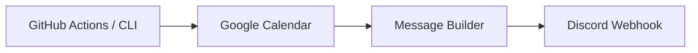

# sakuragi-bot

Google Calendar の当日予定を取得し、Discord webhook へ日次投稿する Bot です。



## Features

- Google Calendar の当日予定を Discord へ投稿
- 複数カレンダー / 複数 webhook の route 設定
- 投稿文テンプレートの差し替え
- 予定なし投稿、住所表示、dry-run の切り替え
- GitHub Actions による定期実行と失敗通知

## Quick Start

```bash
npm ci
npm run build
npm start -- --dry-run
```

ローカル実行には `config.json` または環境変数で Google Calendar、Discord webhook、Google サービスアカウントを設定します。

```bash
cp config.sample.json config.json
```

任意の日付で確認する場合は `--date YYYY-MM-DD` を指定します。

```bash
npm start -- --dry-run --date 2026-04-22
```

## Documentation

| ドキュメント | 内容 |
| --- | --- |
| [Overview](docs/overview.md) | システムの全体像と処理フロー |
| [Setup](docs/setup.md) | 初回セットアップと動作確認 |
| [Operations](docs/operations.md) | GitHub Actions 運用、ログ、障害時の確認 |
| [Architecture](docs/architecture.md) | ソース構成、依存関係、テスト方針 |
| [Configuration](docs/configuration.md) | 環境変数、`config.json`、テンプレート |
| [Troubleshooting](docs/troubleshooting.md) | よくあるエラーと対処 |

## Development

```bash
npm run security:lockfile
npm run security:audit
npm run build
npm test
npm run test:coverage
```

`npm start` は `dist/cli.js` を起動します。実行前に `npm run build` で `dist` を生成してください。
