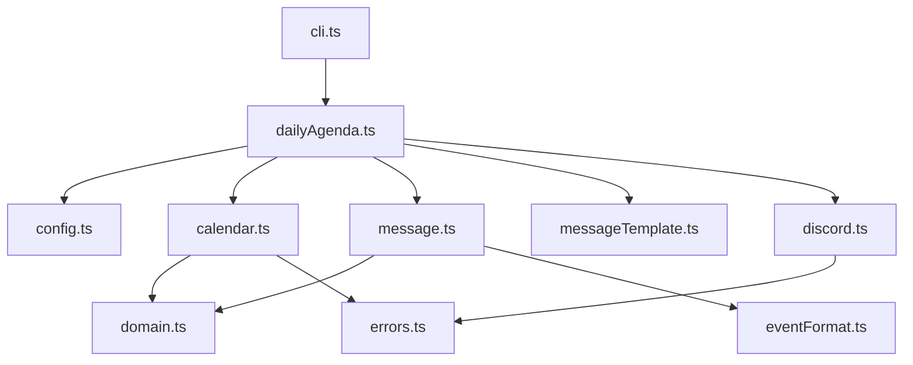
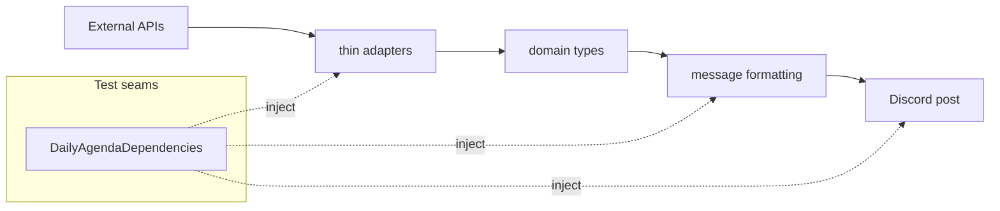
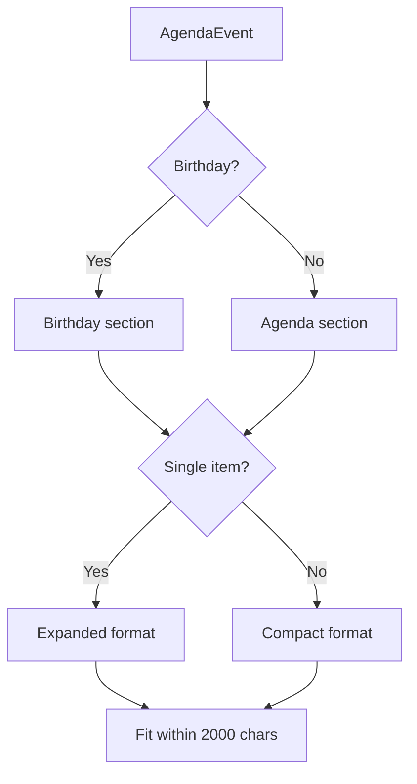

# Architecture

中心は `src/dailyAgenda.ts` です。CLI、設定、Google Calendar、本文生成、Discord 投稿をつなぎます。

## Source Map

| ファイル | 役割 |
| --- | --- |
| `src/cli.ts` | CLI entrypoint。`--dry-run` と `--date` を解釈します。 |
| `src/dailyAgenda.ts` | 設定、予定取得、本文生成、Discord 投稿の orchestration。 |
| `src/calendar.ts` | Google Calendar API 接続と Google 型から内部予定型への変換。 |
| `src/config.ts` | 設定ファイル、環境変数、URL/JSON の検証。 |
| `src/discord.ts` | Discord webhook 投稿と retry 制御。 |
| `src/message.ts` | Discord 投稿本文の生成と 2000 文字制限の調整。 |
| `src/messageTemplate.ts` | 投稿文テンプレートの読み込み、検証、placeholder 置換。 |
| `src/eventFormat.ts` | 予定種別、日付範囲、compact/expanded 表示の判定。 |
| `src/domain.ts` | アプリ内部の予定型。 |
| `src/dependencies.ts` | テストで差し替える依存関係の型。 |
| `src/errors.ts` | Google / Discord エラーの分類ログ。 |
| `src/logger.ts` | winston logger の生成。 |

## Dependency Pattern

外部 API、現在日時、投稿処理は `DailyAgendaDependencies` で差し替えられます。ユニットテストはネットワークや実日時に依存しない構成です。

## Message Rules

Discord webhook の `content` は 2000 文字までです。予定が多い場合は、入る予定だけを含め、末尾に `...他 N 件の予定があります` を追加します。

## Test Scope

| テスト | 主な対象 |
| --- | --- |
| `tests/config.test.ts` | 設定の優先順位、JSON/URL 検証、route 解決 |
| `tests/calendar.test.ts` | Google Calendar 型から内部予定型への変換 |
| `tests/message.test.ts` | 投稿本文、日付表示、文字数制限 |
| `tests/messageTemplate.test.ts` | テンプレート読み込みと placeholder |
| `tests/discord.test.ts` | webhook 投稿、retry、エラー |
| `tests/dailyAgenda.test.ts` | 日次処理全体の orchestration |
| `tests/cli.test.ts` | CLI option と直接実行判定 |
| `tests/errors.test.ts` | エラー分類ログ |
