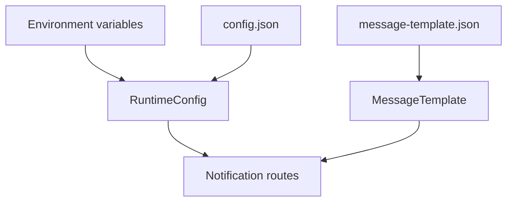

# Configuration

設定は環境変数またはリポジトリ直下の `config.json` で指定します。環境変数がある場合は環境変数を優先します。



## Settings

| 環境変数 | `config.json` | 説明 |
| --- | --- | --- |
| `GOOGLE_CALENDAR_ID` | `googleCalendarId` | 投稿対象の Google Calendar ID |
| `DISCORD_WEBHOOK_URL` | `discordWebhookUrl` | 投稿先の Discord webhook URL |
| `AGENDA_NOTIFICATIONS_JSON` | `notifications` | 複数カレンダー・複数 webhook の通知設定 JSON |
| `GOOGLE_SERVICE_ACCOUNT_JSON` | - | Google サービスアカウント JSON の文字列 |
| `GOOGLE_SERVICE_ACCOUNT_PATH` | `googleServiceAccountPath` | Google サービスアカウント JSON ファイルのパス |
| `MESSAGE_TEMPLATE_PATH` | `messageTemplatePath` | 投稿文テンプレート JSON ファイルのパス |
| `POST_WHEN_NO_EVENTS` | `postWhenNoEvents` | 予定がない日も Discord へ投稿するか |
| `INCLUDE_LOCATION_ADDRESS` | `includeLocationAddress` | 場所に含まれる日本の住所も投稿するか |

`GOOGLE_SERVICE_ACCOUNT_JSON` が JSON 文字列として設定されている場合は、ファイルパスより優先されます。`MESSAGE_TEMPLATE_PATH` が未設定の場合は、リポジトリ直下の `message-template.json` を読み込みます。

## Route Configuration

`AGENDA_NOTIFICATIONS_JSON` または `config.json` の `notifications` に JSON array を設定します。

```json
[
  {
    "id": "team-a",
    "calendarId": "team-a-calendar.example",
    "webhookUrls": [
      "https://discord.com/api/webhooks/team-a-id/team-a-token"
    ]
  }
]
```

| キー | 必須 | 説明 |
| --- | --- | --- |
| `id` | 任意 | ログに出す通知設定名。未指定の場合は `route-1` 形式。 |
| `calendarId` | 必須 | 予定を取得する Google Calendar ID |
| `webhookUrls` | 必須 | 投稿先 Discord webhook URL の配列 |
| `messageTemplatePath` | 任意 | route 専用の投稿文テンプレート |
| `postWhenNoEvents` | 任意 | 予定なし投稿の有無を route 単位で上書き |
| `includeLocationAddress` | 任意 | 住所表示の有無を route 単位で上書き |

`AGENDA_NOTIFICATIONS_JSON` が設定されている場合は、単一通知用の `GOOGLE_CALENDAR_ID` / `DISCORD_WEBHOOK_URL` より優先されます。

## Defaults

| 項目 | 既定値 |
| --- | --- |
| `postWhenNoEvents` | `false` |
| `includeLocationAddress` | `false` |
| `messageTemplatePath` | `./message-template.json` |

`includeLocationAddress=false` の場合、`施設名, 日本、〒170-0013 東京都...` のような場所は施設名だけを投稿します。`Zoom, 第2会議室` のように住所と判断できない補足はそのまま表示します。

## Message Template

投稿本文の文言は `message-template.json` で編集できます。すべてのキーは任意で、未設定や空白だけの値は既定文言で補完されます。

代表的なキーは以下です。

| キー | 用途 |
| --- | --- |
| `greeting` | 投稿冒頭の挨拶 |
| `noEventsLine` | 予定がない日の本文 |
| `agendaLine` | 予定がある日の本文 |
| `birthdayHeader` | 誕生日セクション見出し |
| `agendaHeader` | 通常予定セクション見出し |
| `birthdayLine` | 複数誕生日の 1 行表示 |
| `timedEventLine` | 時間付き予定の 1 行表示 |
| `allDayEventLine` | 終日予定の 1 行表示 |
| `omissionLine` | 文字数上限で省略した件数の表示 |

placeholder の詳細は `message-template.json` を参照してください。テンプレート値は Markdown 記法や字下げ用の空白を保持します。
