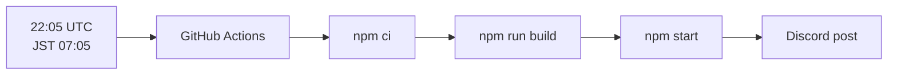
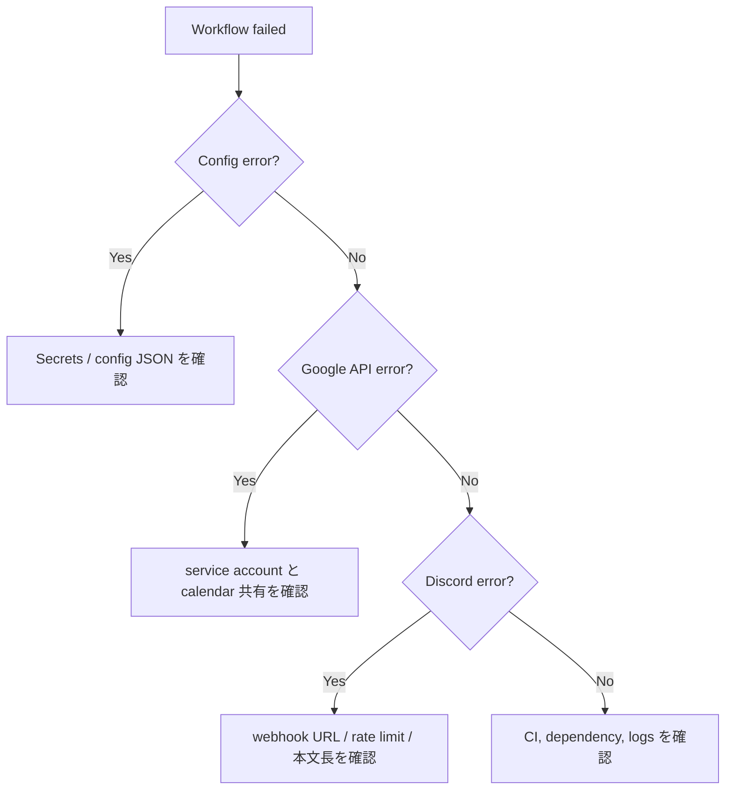
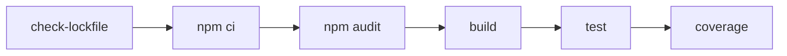

# Operations

通常運用は GitHub Actions の `.github/workflows/daily-agenda.yml` で行います。手動確認や設定変更後は、まず dry-run でログを確認します。

## Schedule

GitHub Actions の cron は UTC です。現在の定期実行は `5 22 * * *` で、JST 7:05 に相当します。

## Repository Secrets

| Secret | 必須 | 説明 |
| --- | --- | --- |
| `GOOGLE_SERVICE_ACCOUNT_JSON` | 必須 | Google サービスアカウント JSON 全体 |
| `GOOGLE_CALENDAR_ID` | 単一通知時は必須 | 予定を取得する Google Calendar ID |
| `DISCORD_WEBHOOK_URL` | 単一通知時は必須 | 投稿先 Discord webhook URL |
| `AGENDA_NOTIFICATIONS_JSON` | 複数通知時は必須 | 複数 route の JSON array |
| `FAILURE_DISCORD_WEBHOOK_URL` | 任意 | GitHub Actions 失敗通知先 |

`AGENDA_NOTIFICATIONS_JSON` がある場合は、`GOOGLE_CALENDAR_ID` と `DISCORD_WEBHOOK_URL` より優先されます。

## Manual Run

GitHub Actions の `Run workflow` から手動実行できます。

| 入力 | 説明 |
| --- | --- |
| `date` | 取得対象日。未指定の場合は JST 当日。形式は `YYYY-MM-DD`。 |
| `dry_run` | Discord へ投稿せず、生成本文をログで確認します。既定値は `true`。 |

初回や設定変更後は `dry_run=true` で確認し、問題がなければ `dry_run=false` で投稿します。dry-run のログには投稿予定本文が含まれるため、予定名、場所、説明などの閲覧範囲は GitHub Actions logs の閲覧権限と同じになります。本番予定を扱う場合は、ログ閲覧者を maintainer に限定します。

本番 Secrets を使うため、手動実行できるユーザーは信頼できる maintainer に限定します。GitHub repository settings で Actions の実行権限を確認し、必要に応じて `daily-agenda.yml` を protected environment に紐づけ、environment approval を有効化します。

## External Risk Management

以下はリポジトリ内のコードだけでは完結しないため、管理者または保守担当者が GitHub、Google、Discord 側で定期的に確認します。

### GitHub Actions access

リスク: 本番 Secrets を使う workflow を広い権限のユーザーが実行できると、設定ミスや悪意ある変更によって Google サービスアカウント JSON、Discord webhook URL、予定本文が漏洩する可能性があります。

確認と設定:

1. Repository の `Settings` -> `Actions` -> `General` を開きます。
2. `Actions permissions` は、必要な GitHub Actions と reusable workflows のみ許可します。不要な third-party action を広く許可しません。
3. `Workflow permissions` は `Read repository contents permission` を選びます。このリポジトリの workflow は repository 書き込み権限を必要としません。
4. `Allow GitHub Actions to create and approve pull requests` は無効にします。
5. `Run workflow` を使える repository write 権限保持者を棚卸しし、保守担当者に限定します。
6. `Actions` の workflow run logs を閲覧できるユーザーが、予定本文や dry-run 出力を見てもよい範囲に収まっていることを確認します。

より強く保護する場合は、GitHub Environments を使います。

1. Repository の `Settings` -> `Environments` で `production` などの環境を作成します。
2. `Required reviewers` に本番実行を承認できる maintainer を設定します。
3. 本番 Secrets を repository secrets から environment secrets へ移します。
4. `.github/workflows/daily-agenda.yml` の job に `environment: production` を追加します。
5. 手動実行時に承認待ちになり、承認前に Secrets が job に渡らないことを確認します。

参考: GitHub Docs の Actions settings、Environments、Secrets の説明を確認します。

### GitHub branch and review policy

リスク: workflow、依存関係、投稿ロジックを変更できる PR が十分にレビューされずに merge されると、Secrets や予定情報を外部送信する変更が混入する可能性があります。

確認と設定:

1. `Settings` -> `Branches` で default branch に branch protection rule または ruleset を設定します。
2. `Require a pull request before merging` を有効にします。
3. `Require approvals` は最低 1 名、可能なら bot の運用を理解している maintainer を必須にします。
4. `Require status checks to pass before merging` で CI、test、coverage、lockfile check を必須にします。
5. `.github/workflows/`、`src/config.ts`、`src/discord.ts`、`src/calendar.ts`、`package-lock.json` の変更は重点レビュー対象にします。
6. GitHub Advanced Security または利用可能な secret scanning がある場合は有効化します。

### Google service account and calendar sharing

リスク: サービスアカウントが不要なカレンダーへ共有されていると、設定ミスや webhook 漏洩時の情報流出範囲が広がります。

確認と設定:

1. Google Cloud Console で対象 project の `IAM & Admin` -> `Service Accounts` を開きます。
2. bot 用 service account がこの用途専用であることを確認します。別用途と共用しません。
3. service account key は原則 1 つだけ有効にし、不要な key は削除します。
4. Google Calendar の対象カレンダー設定で、service account の `client_email` が共有先に含まれていることを確認します。
5. 権限は予定詳細の読み取りに必要な最小権限にします。編集権限は付けません。
6. 通知対象ではないカレンダーから service account の共有を削除します。
7. `AGENDA_NOTIFICATIONS_JSON` の各 `calendarId` と、実際に共有されているカレンダーの対応を定期的に照合します。

### Discord channel and webhook control

リスク: Discord webhook URL は bearer secret です。漏洩すると webhook を削除するまで第三者が投稿できます。また、投稿先チャンネルの閲覧者が多いほど予定情報の露出範囲が広がります。

確認と設定:

1. Discord server の対象チャンネルで、閲覧できる role と member を確認します。
2. webhook の作成、編集、削除ができる role を server 管理者または bot 保守担当者に限定します。
3. webhook は通知先チャンネルごとに分けます。複数チャンネルで同じ webhook URL を使い回しません。
4. 不要な webhook、用途不明な webhook、作成者が不明な webhook は削除します。
5. 漏洩疑い、退職、担当変更、チャンネル用途変更があった場合は Secret Rotation の手順に従って URL を更新します。
6. Discord 側で `@everyone` や role mention の使用権限も必要最小限にします。アプリ側は `allowed_mentions` で通知化を抑止していますが、通常ユーザー投稿の統制は Discord 権限で管理します。

### Dependency and package maintenance

リスク: npm package や GitHub Actions の supply chain が侵害されると、日次実行時に Secrets や予定情報へアクセスされる可能性があります。

確認と設定:

1. Dependabot security update を有効にし、security PR は優先して確認します。
2. dependency update PR では `package-lock.json` の registry、resolved URL、install script の有無を重点確認します。
3. CI の `npm ci --ignore-scripts` と `.npmrc` の `ignore-scripts=true` を維持します。
4. GitHub Actions の third-party action は必要最小限にし、可能なら trusted publisher または commit SHA pinning を検討します。
5. `npm audit --audit-level=high` の失敗は、runtime dependency か dev dependency かを切り分けて判断します。

### Reference links

- GitHub Actions settings: https://docs.github.com/en/github/administering-a-repository/disabling-or-limiting-github-actions-for-a-repository
- GitHub Actions environments: https://docs.github.com/actions/deployment/about-deployments/deploying-with-github-actions
- GitHub Actions secrets: https://docs.github.com/actions/reference/encrypted-secrets
- Google Calendar sharing permissions: https://support.google.com/calendar/answer/15716974
- Discord webhooks: https://docs.discord.com/developers/platform/webhooks

## Failure Triage

失敗通知用の `FAILURE_DISCORD_WEBHOOK_URL` が未設定の場合、失敗通知ステップはスキップされます。通常投稿には影響しません。

## Secret Rotation

Discord webhook URL や Google サービスアカウント JSON が漏洩した疑いがある場合は、新しい値へ切り替えて動作確認し、古い値を無効化します。

### Discord webhook

1. Discord の対象チャンネル設定で新しい webhook を作成します。
2. GitHub Secrets の `DISCORD_WEBHOOK_URL`、複数通知の場合は `AGENDA_NOTIFICATIONS_JSON` 内の webhook URL を新しい値に更新します。
3. `dry_run=false` を使う前に、必要なら一時チャンネルで疎通確認します。
4. 漏洩した古い webhook を Discord 側で削除します。
5. `FAILURE_DISCORD_WEBHOOK_URL` も使っている場合は同じ手順で更新します。

### Google service account key

1. Google Cloud で同じ service account の新しい JSON key を発行します。
2. GitHub Secret `GOOGLE_SERVICE_ACCOUNT_JSON` を新しい JSON 全体で更新します。
3. service account が通知対象カレンダーに read-only で共有されていることを確認します。
4. GitHub Actions を `dry_run=true` で実行し、予定取得だけ確認します。
5. 古い JSON key を Google Cloud 側で削除します。

### Periodic review

- Discord webhook は投稿先チャンネル単位で分け、不要になった webhook は削除します。
- service account は通知対象カレンダー以外に共有しません。
- GitHub Secrets の更新権限を持つユーザーを定期的に確認します。

## Security Checklist

- `config.json`、サービスアカウント JSON、実際の webhook URL をコミットしない
- 本番 Secrets を使う workflow の手動実行権限を maintainer に限定する
- 必要に応じて GitHub protected environment と reviewer approval を設定する
- 投稿先 Discord チャンネルの閲覧者を確認する
- サービスアカウントは通知対象カレンダーだけに共有する
- 不要になった JSON キーやカレンダー共有を削除する
- Dependabot PR は CI、audit、test を確認してから取り込む

## CI

`.github/workflows/ci.yml` は pull request と `main` への push で実行されます。

依存パッケージの install lifecycle script は `.npmrc` と CI の `--ignore-scripts` で無効化しています。Git URL や tarball URL 由来の依存は `npm run security:lockfile` で検出します。
