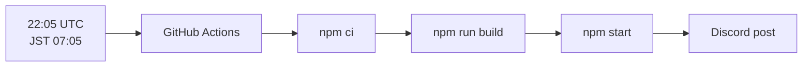
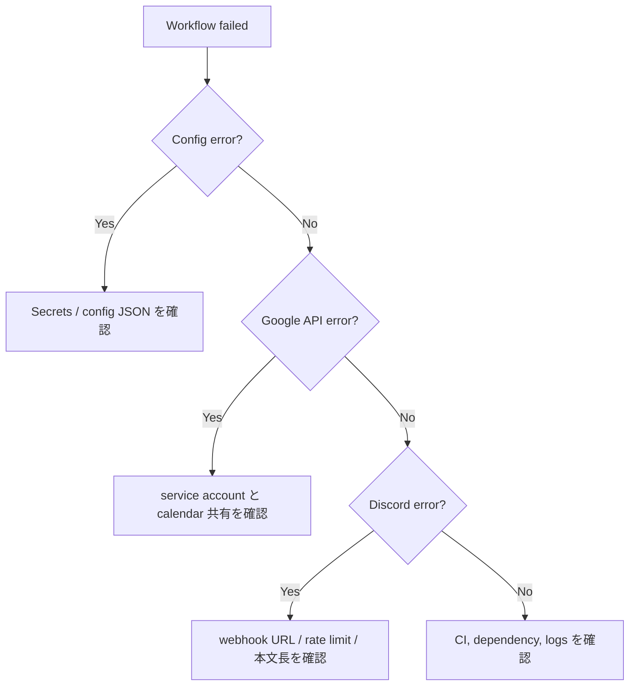
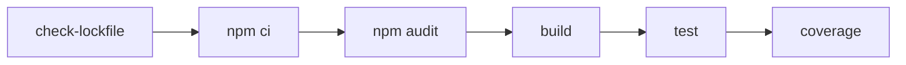

# Operations

通常運用は GitHub Actions の `.github/workflows/daily-agenda.yml` で行います。手動確認や設定変更後は、まず dry-run でログを確認します。

## Schedule

GitHub Actions の cron は UTC です。現在の定期実行は `5 22 * * *` で、JST 7:05 に相当します。

## Repository Secrets

| Secret | 必須 | 説明 |
| --- | --- | --- |
| `GOOGLE_SERVICE_ACCOUNT_JSON` | 必須 | Google サービスアカウント JSON 全体 |
| `GOOGLE_CALENDAR_ID` | 単一通知時は必須 | 予定を取得する Google Calendar ID |
| `DISCORD_WEBHOOK_URL` | 単一通知時は必須 | 投稿先 Discord webhook URL |
| `AGENDA_NOTIFICATIONS_JSON` | 複数通知時は必須 | 複数 route の JSON array |
| `FAILURE_DISCORD_WEBHOOK_URL` | 任意 | GitHub Actions 失敗通知先 |

`AGENDA_NOTIFICATIONS_JSON` がある場合は、`GOOGLE_CALENDAR_ID` と `DISCORD_WEBHOOK_URL` より優先されます。

## Manual Run

GitHub Actions の `Run workflow` から手動実行できます。

| 入力 | 説明 |
| --- | --- |
| `date` | 取得対象日。未指定の場合は JST 当日。形式は `YYYY-MM-DD`。 |
| `dry_run` | Discord へ投稿せず、生成本文をログで確認します。既定値は `true`。 |

初回や設定変更後は `dry_run=true` で確認し、問題がなければ `dry_run=false` で投稿します。

## Failure Triage

失敗通知用の `FAILURE_DISCORD_WEBHOOK_URL` が未設定の場合、失敗通知ステップはスキップされます。通常投稿には影響しません。

## Security Checklist

- `config.json`、サービスアカウント JSON、実際の webhook URL をコミットしない
- 投稿先 Discord チャンネルの閲覧者を確認する
- サービスアカウントは通知対象カレンダーだけに共有する
- 不要になった JSON キーやカレンダー共有を削除する
- Dependabot PR は CI、audit、test を確認してから取り込む

## CI

`.github/workflows/ci.yml` は pull request と `main` への push で実行されます。

依存パッケージの install lifecycle script は `.npmrc` と CI の `--ignore-scripts` で無効化しています。Git URL や tarball URL 由来の依存は `npm run security:lockfile` で検出します。
