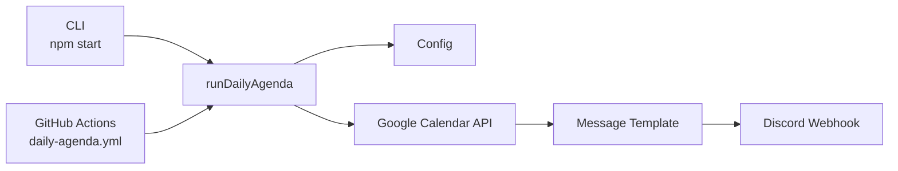
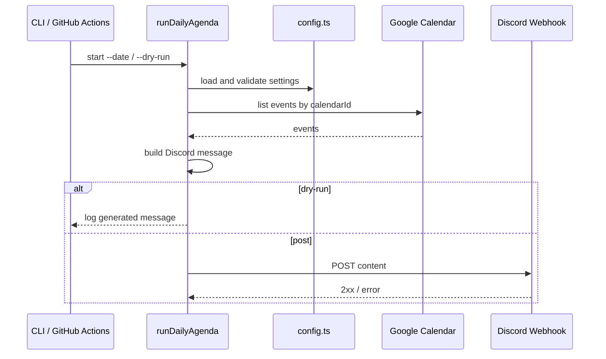
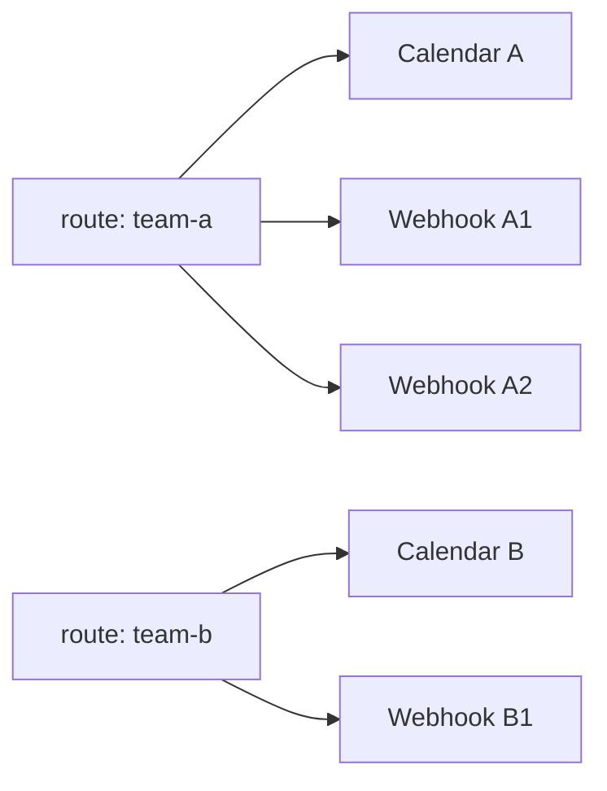

# Overview

sakuragi-bot は Google Calendar の当日予定を読み取り、Discord webhook へ投稿する小さな日次 Bot です。ローカル CLI と GitHub Actions のどちらからでも同じ処理を実行します。

## Responsibilities

| 領域 | この Bot が行うこと | 行わないこと |
| --- | --- | --- |
| Calendar | 当日範囲の予定取得、内部形式への変換 | 予定の作成・更新・削除 |
| Message | 誕生日、終日、時間付き、複数日予定の整形 | Discord のリッチ埋め込み生成 |
| Discord | webhook への投稿、429/5xx の再試行 | Bot token による Discord API 操作 |
| Operations | GitHub Actions 定期実行、dry-run | 永続 DB、管理画面 |

## Runtime Flow

## Notification Routes

複数の通知先は route として扱います。1 route は 1 つのカレンダーと 1 個以上の Discord webhook を持ちます。

同じ `calendarId` を複数 route で使う場合、Google Calendar API への取得は実行内で 1 回にまとめます。webhook 投稿は webhook ごとに行い、一部が失敗しても他の webhook 投稿は継続します。

## Public Repository Notes

公開リポジトリでは、実際の `calendarId`、Discord webhook URL、サービスアカウント JSON をコミットしません。GitHub Actions 運用では Repository secrets に登録します。
