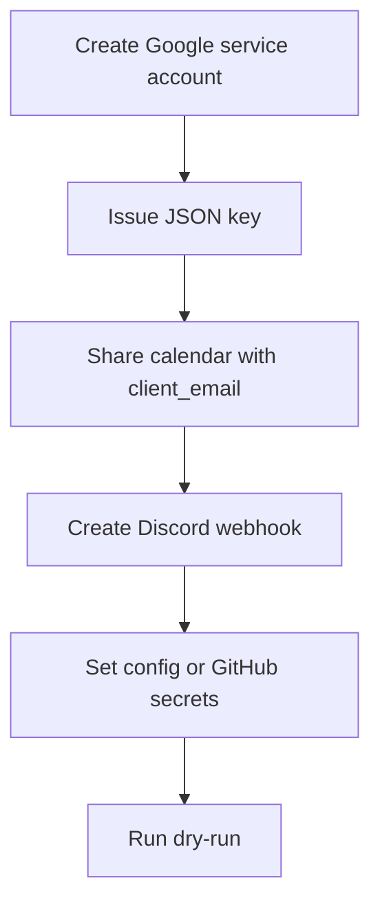

# Setup

初回セットアップは、Google サービスアカウント、Calendar 共有、Discord webhook、実行設定の順に行います。



## Requirements

- Node.js `>=22.12.0`
- npm
- Google Calendar API を読めるサービスアカウント
- Discord webhook URL

## Local Setup

```bash
npm ci
cp config.sample.json config.json
npm run build
npm start -- --dry-run
```

`config.json` にはローカル検証用の値を入れます。公開リポジトリへ実値をコミットしないでください。

サービスアカウント JSON をファイルで使う場合は、`config.json` の `googleServiceAccountPath` にパスを設定します。GitHub Actions では JSON 全体を `GOOGLE_SERVICE_ACCOUNT_JSON` secret に登録する運用を推奨します。

## Google Calendar Sharing

1. Google Cloud でサービスアカウントを作成します。
2. サービスアカウントに JSON キーを発行します。
3. JSON 内の `client_email` を控えます。
4. Google Calendar の対象カレンダー設定を開きます。
5. `特定のユーザーまたはグループと共有する` に `client_email` を追加します。
6. 権限は `予定の表示（すべての予定の詳細）` を付与します。
7. GitHub Actions で使う場合は、JSON 全体を `GOOGLE_SERVICE_ACCOUNT_JSON` secret に登録します。

カレンダーを共有していない場合、実行時に Google API の 403 エラーになります。

## Discord Webhook

Discord の対象チャンネルで webhook を作成し、URL を設定します。実行時には `https://discord.com/api/webhooks/...` または `https://discordapp.com/api/webhooks/...` だけを許可します。

## Dry Run

Discord へ投稿せず、生成本文をログで確認します。

```bash
npm start -- --dry-run --date 2026-04-22
```

予定がない日かつ `postWhenNoEvents` が `false` の場合、本文生成は行わずスキップログだけを出します。予定なし本文も確認したい場合は `POST_WHEN_NO_EVENTS=true` を併用してください。
