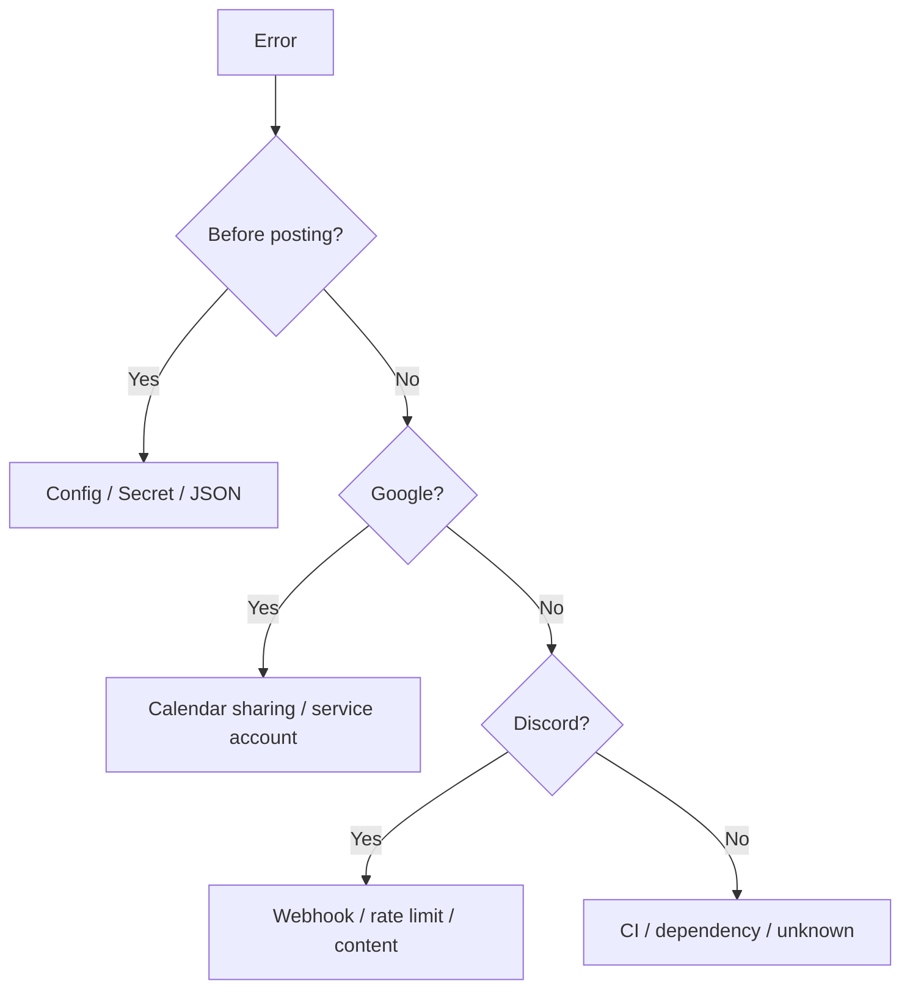
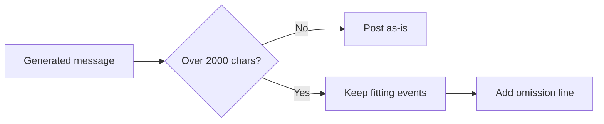

# Troubleshooting

起動時に設定値を検証し、不足や形式不正がある場合は Discord 投稿前に停止します。

## Common Errors

| エラー | 主な原因 | 対応 |
| --- | --- | --- |
| `Missing configuration: GOOGLE_CALENDAR_ID or config.googleCalendarId` | カレンダー ID が未設定 | `GOOGLE_CALENDAR_ID` secret または `config.json` を設定します。 |
| `Missing configuration: DISCORD_WEBHOOK_URL or config.discordWebhookUrl` | Discord webhook URL が未設定 | `DISCORD_WEBHOOK_URL` secret または `config.json` を設定します。 |
| `AGENDA_NOTIFICATIONS_JSON の JSON 解析に失敗しました` | 複数通知設定の JSON が壊れている | Repository secret の JSON array 形式を確認します。 |
| `通知設定 ... に calendarId がありません` | route にカレンダー ID がない | 対象 route に `calendarId` を設定します。 |
| `通知設定 ... に webhookUrls がありません` | route に webhook URL がない | 対象 route に `webhookUrls` 配列を設定します。 |
| `Discord webhook URL である必要があります` | URL が Discord webhook endpoint ではない | Discord の webhook URL を設定し直します。 |
| `GOOGLE_SERVICE_ACCOUNT_JSON または GOOGLE_SERVICE_ACCOUNT_PATH` | サービスアカウント JSON が未設定 | GitHub Actions では `GOOGLE_SERVICE_ACCOUNT_JSON` secret を設定します。 |
| `GOOGLE_SERVICE_ACCOUNT_JSON に client_email がありません` | JSON が壊れている、または別形式 | Google Cloud から発行した JSON 全体を登録します。 |
| `GOOGLE_SERVICE_ACCOUNT_JSON に private_key がありません` | 秘密鍵を含まない JSON | JSON キーを再発行して登録します。 |
| `Google API の認証/権限エラーです。` | カレンダー未共有、JSON 誤り、権限不足 | `client_email` を対象カレンダーへ共有します。 |
| `Google API のレート制限に達しました。` | Google API の一時的な制限 | 時間を置いて再実行します。 |
| `Discord webhook error: 400 ...` | webhook URL または本文形式の問題 | webhook URL と dry-run の本文を確認します。 |
| `Discord webhook error: 429 ...` | Discord 側のレート制限 | bot は `retry-after` を見て再試行します。頻発する場合は実行頻度を見直します。 |

## Message Length

Discord webhook の `content` は 2000 文字までです。この Bot は投稿本文を 2000 文字以内へ収めます。

予定が多い、または予定名・場所・説明文が長い場合は、入りきる予定だけを本文へ含め、末尾に `...他 N 件の予定があります` を追加します。予定の `description` は 1 件あたり 100 文字を超えると `...` 付きで省略します。

## Description Formatting

Google Calendar の説明文に含まれる HTML は投稿前にプレーンテキストへ整形します。HTML entity は復号し、HTML タグは除去します。

説明文内に `https://www.google.com/url?q=...` 形式の Google リダイレクト URL が含まれる場合は、`q` パラメータの元 URL へ正規化します。
